# Mémo Defold

*par flashjaysan*

Licence Creative Commons : Cette œuvre est mise à disposition selon les termes de la Licence Creative Commons Attribution - Pas d’Utilisation Commerciale 4.0 Internationale.


## Introduction

*Defold* est un outil pour créer des jeux vidéos. Il est gratuit mais non open source. La société *King* (Candy Crush) utilise ce moteur pour créer ses jeux et le fournit au public gratuitement et sans licence ni contrepartie. Les jeux créés avec *Defold* sont programmés en *Lua*, un langage de script facile à apprendre et puissant. Vous pouvez exporter vos jeux sur les plateformes *Windows*, *Mac OS X*, *Linux*, *Android*, *iOS* et *HTML*. Vous pouvez stocker vos projets sur le cloud dédié de *Defold* (ou un cloud compatible avec *Git*) et les partager avec d'autres membres de votre équipe ou, si vous préférez, sur votre propre ordinateur.

**Attention !** *Defold* nécessite de posséder un compte *Google* et vous devrez être connecté à *Internet* pour créer vos premiers projets (basés sur des modèles en ligne).

## Télécharger et installer Defold

Visitez le site de *Defold* :
[https://www.defold.com/](https://www.defold.com/)
Et cliquez sur la section `Get Defold`.


**Attention !** Pour télécharger *Defold*, vous devez vous identifier avec un compte *Google*.

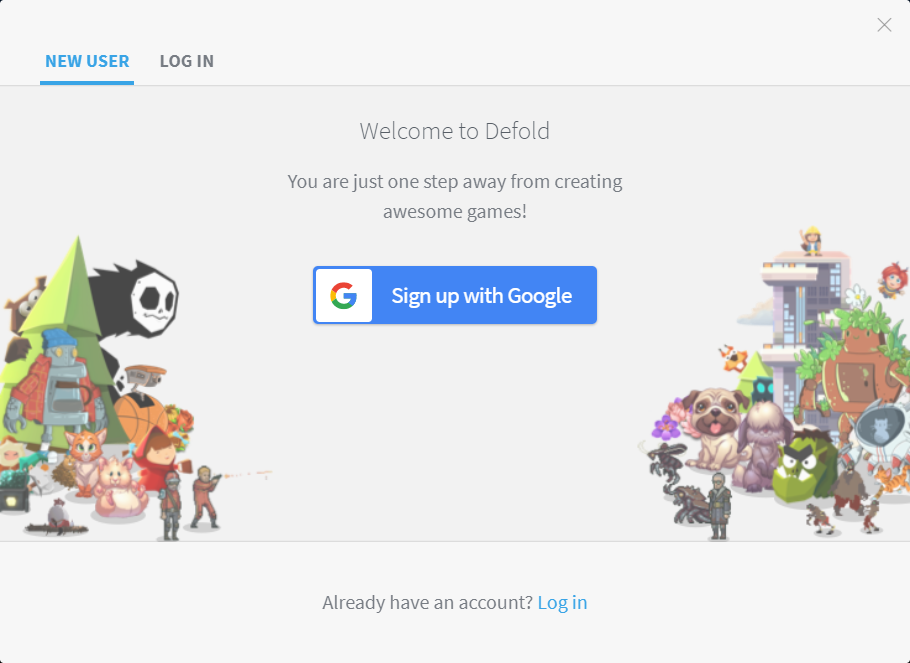

Une fois connecté, cliquez sur la section `Dashboard`.

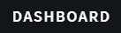

Téléchargez la dernière version de *Defold* correspondante à votre système en cliquant sur le bouton `Download editor`. 

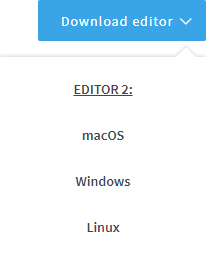

- Sur Windows, décompressez l'intégralité du contenu du fichier téléchargé à l'emplacement de votre choix puis exécutez le fichier `Defold.exe`.
- Sur Mac OS X, montez le fichier téléchargé et faites glisser l'application `Defold` dans le dossier `Applications` puis exécutez ce fichier.
- Sur Linux, décompressez l'intégralité du contenu du fichier téléchargé à l'emplacement de votre choix puis exécutez le fichier `./Defold`.

## Mettre à jour Defold

Au démarrage de *Defold*, le texte `Update Available` apparaît si une nouvelle version est disponible.

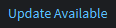

Cliquez dessus pour afficher la boîte de dialogue `Update Available`.

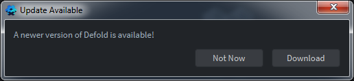

Cliquez alors sur le bouton `Download` pour télécharger et mettre à jour automatiquement *Defold* ou sur le bouton `Not Now` pour annuler la procédure.

Si vous effectuer une mise à jour de *Defold*, une barre de chargement apparaît pour indiquer l'état d'avancement du téléchargement.

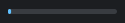

**Attention !** Le téléchargement d'une mise à jour est assez long.

**Remarque :** Vous pouvez continuer à utiliser *Defold* pendant le téléchargement de la mise à jour. Une barre de progression apparaît en bas de l'éditeur.
 
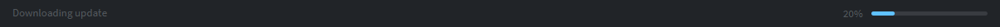

Lorsque le téléchargement est terminé, le texte `Restart to Update` s'affiche.

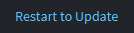

Cliquez dessus pour afficher la boîte de dialogue `Please Confirm`.

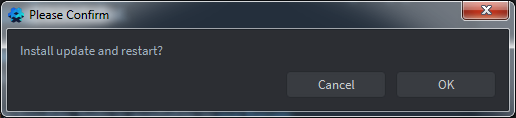

Cliquez alors sur le bouton `OK` pour redémarrer *Defold* et installer la mise à jour ou sur le bouton `Cancel` pour annuler la procédure.

## Création et ouverture de projets

Lorsque vous démarrez *Defold*, l'écran de création et de sélection de projet s'affiche.

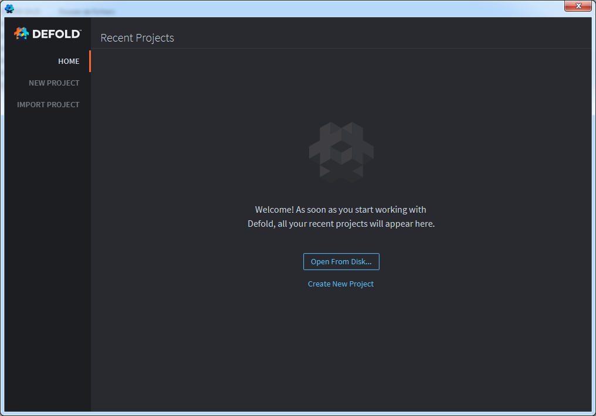

Sur la gauche, il y a trois options :
- Home (par défaut)
- New Project
- Import Project

### Home 

Si vous venez d'installer *Defold*, cette section est vide (voir image précédente). Cliquez sur le bouton `Create New Project` pour créer un nouveau projet. La section `New Project` (voir section suivante) s'affiche alors. Par la suite, la section `Home` affichera la liste de vos projets déjà ouverts dans *Defold* et stockés sur votre ordinateur. Sélectionnez alors un des projets de la liste puis cliquez sur le bouton `Open Selected` pour ouvrir le projet dans l'éditeur.

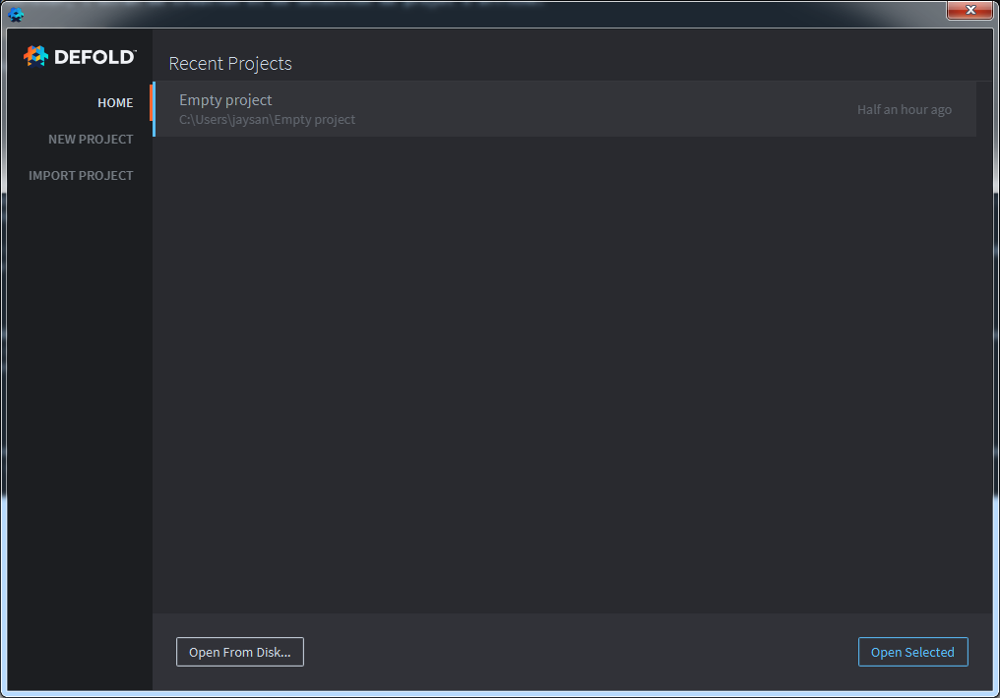

Le bouton `Open From Disk…` présent dans les deux cas de figure vous permet d'ouvrir un projet *Defold* situé sur votre ordinateur. Une boîte de dialogue s'ouvre alors et vous demande de sélectionner un fichier `game.project` associé à un projet.

### New Project

Cette section sert à créer de nouveaux projets.

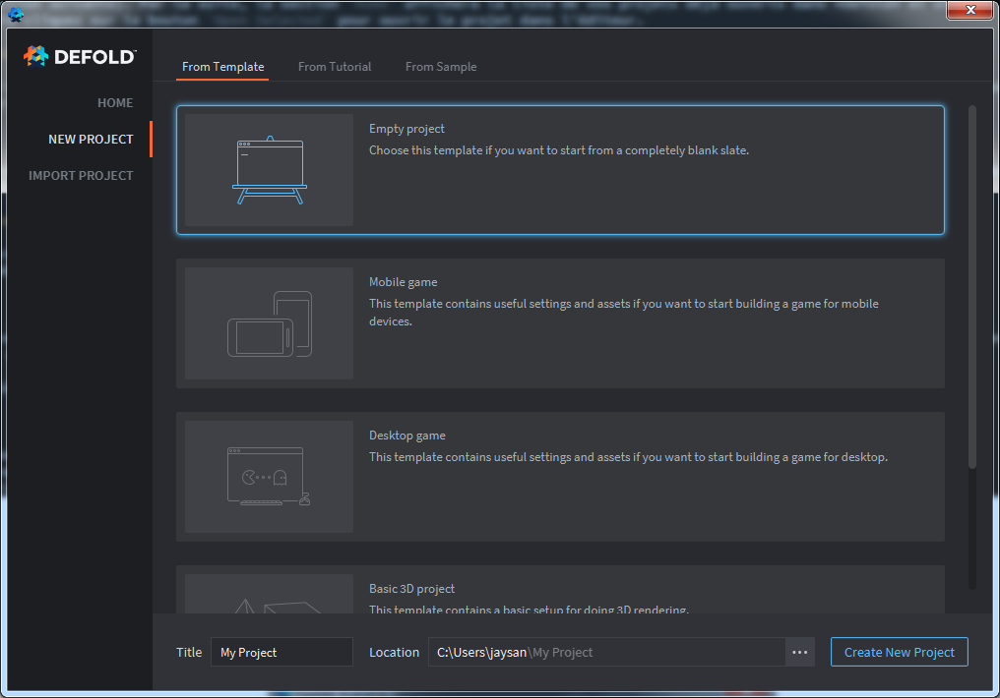

**Attention !** Vous devez obligatoirement être connecté à *Internet* pour créer un nouveau projet car *Defold* se base sur des modèles stockés en ligne. 

Cliquez sur l'un des trois onglets :
- From Template (par défaut)
- From Tutorial
- From Sample

**Conseil :** Si vous voulez créer un nouveau projet sans connexion *Internet*, créez des modèles de projets lorsque vous êtes connecté et sauvegardez-les sur votre ordinateur. Vous n'aurez plus qu'à les copier et à ouvrir ces copies dans *Defold*.

**Remarque :** N'oubliez pas de choisir un nom de projet et de définir son emplacement sur votre ordinateur en bas de la fenêtre de *Defold*.

#### From Template

Cette option crée un nouveau projet à partir de modèles pré-existants (voir image précédente). Cliquez sur l'une des options proposées :
- **Empty project :** Cette option crée un projet vide générique. Vous devez tout paramétrer vous-même.
- **Mobile game :** Cette option crée un projet adapté aux smartphones ou aux tablettes.
- **Desktop game :** Cette option crée un projet adapté aux ordinateurs classiques.
- **Basic 3D project :** Cette option crée un projet en 3D.

#### From Tutorial

Cette option crée un projet destiné à apprendre à utiliser *Defold*. Chaque projet vous apprend une technique différente. Choisissez un des projets proposés et suivez les instructions (en anglais) contenues dans le fichier `README.md` situé dans la vue `Assets` (voir section `Editeur` plus loin).

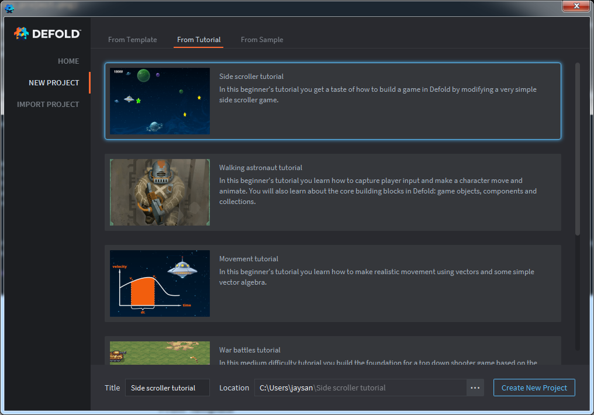

#### From Sample

Cette option créer un projet à partir de projets exemples divers. Choisissez un des projets proposés et examinez les différents éléments les constituants pour étudier leur structure.

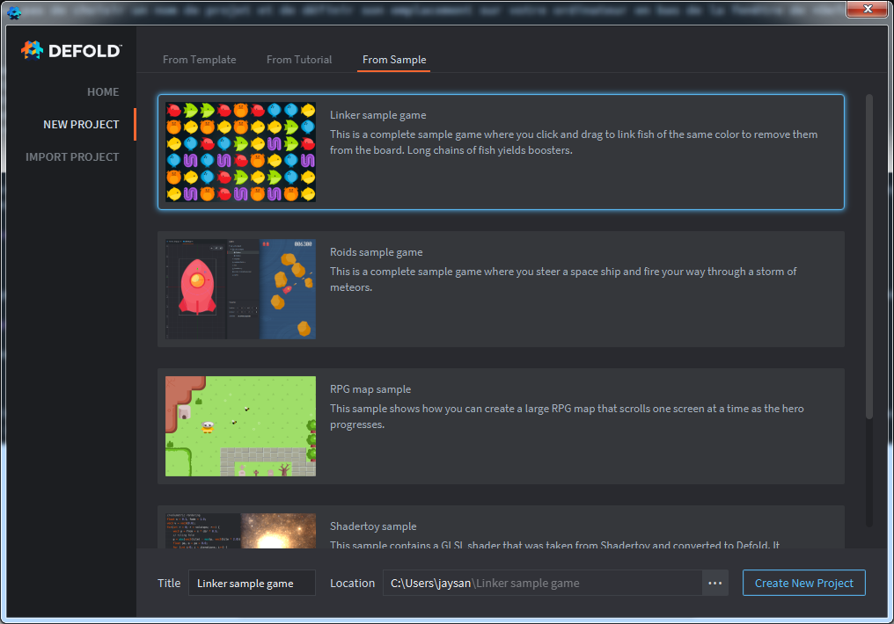

**Remarque :** N'oubliez pas de choisir un nom de projet et de définir son emplacement sur votre ordinateur en bas de la fenêtre de *Defold*.

### Import Project

Cette section est utilisée pour importer un de vos projets stockés en ligne (par défaut sur le cloud de *Defold* mais vous pouvez paramétrer un autre cloud *Git*). Ces projets peuvent être partagés avec d'autres personnes.

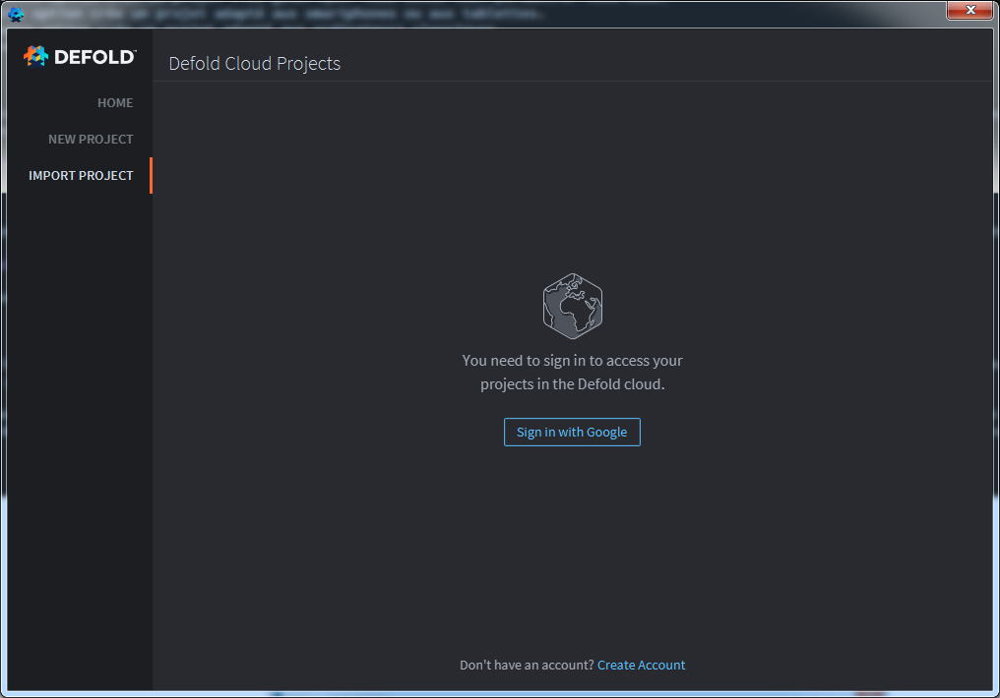

**Attention !** Vous devez vous connecter à *Defold* avec votre compte *Google* pour utiliser cette option. Celle-ci vous permet de télécharger un des projets stockés en ligne et de travailler localement dessus. C'est utile si vous travaillez à plusieurs sur le projet ou si vous utilisez plusieurs machines pour développer votre jeu. Cliquez sur le bouton `Sign in with Google` pour vous connecter ou sur le texte `Create Account` pour créer un nouveau compte. Une fois connecté, *Defold* affiche la liste des projets stockés en ligne. Sélectionnez alors un des projets de la liste puis cliquez sur le bouton `Import Project` pour télécharger et ouvrir le projet dans l'éditeur.

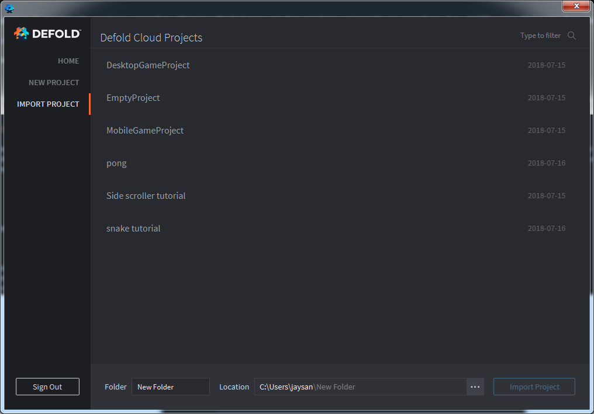

**Remarque :** N'oubliez pas de choisir un emplacement sur votre ordinateur en bas de la fenêtre de *Defold*.

## Editeur

Une fois un projet ouvert, vous vous retrouvez devant la fenêtre de l'éditeur. Elle se compose de nombreuses sections :

- **Vue Assets :** Cette vue liste les fichiers ressources utiles à votre projet.

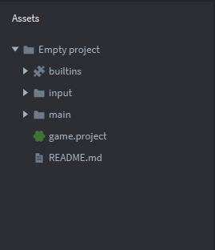

Par un clic droit, créez des dossiers (`New Folder`) ou des éléments (`New` puis un des nombreux choix) utiles à votre jeu.
Vous pouvez couper (`Cut`), copier (`Copy`), coller (`Paste`), effacer (`Delete`) ou renommer (`Rename…`) des fichiers.
Vous pouvez afficher un dossier dans l'explorateur de votre système (`Show In Desktop`).
Double cliquez sur un fichier pour l'ouvrir dans l'éditeur (pour les fichiers créés par *Defold*) ou un programme externe (pour les fichiers importés).
Cliquez sur la flèche à gauche d'un nom de dossier pour le déplier ou le replier.
Faites glisser des fichiers externes dans cette vue pour les importer (ils sont copiés) dans votre projet.
Déplacez des fichiers dans la liste à un autre emplacement pour réorganiser votre projet.

- **Vue Changed Files : ** Cette vue affiche les fichiers qui ont été modifiés ou créés depuis la dernière synchronisation avec les fichiers stockés en ligne.

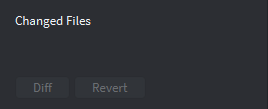

  - Les fichiers modifiés sont précédés du signe `*`.
  - Les fichiers créés sont précédés du signe `+`.
  - Les fichiers supprimés sont précédés du signe `-`.
  - Les fichiers déplacés sont précédés du signe `>>`.

Cliquez sur le bouton `Diff` pour voir les modifications effectuées sur un fichier.
Cliquez sur le bouton `Revert` pour rétablir l'état initial.

**Remarque :** Cette vue ne fonctionne que si vous avez déjà synchronisé au moins une fois votre projet en ligne.

- **Vue Outline : ** Cette vue montre la structure d'une collection ou d'une ressource ouverte dans *Defold*.

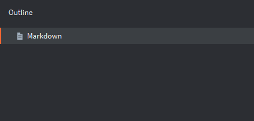

Par un clic droit puis `New`, créez de nouveaux éléments enfants (des sous-collections, des game objects ou des components).

- **Vue Properties :** Cette vue affiche la liste des propriétés de l'élément sélectionné actuellement dans la vue `Outline` ou la vue `Editor`.

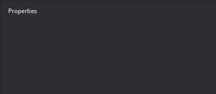

Cela vous permet d'éditer les propriétés des divers éléments de votre jeu.

- **Vue Console, Curve Editor, Build Errors, Search Results :** Cette vue affiche plusieurs outils utiles au développement du jeu.

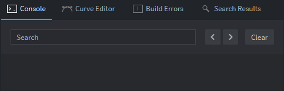

  - **Onglet Console :** Affiche les traces des scripts avec la fonction prédéfinie de *Lua* `print`. Également utilisé avec le débogueur intégré.
  - **Onglet Curve Editor :** Affiche l'éditeur de courbes pour la gestion des particules.
  - **Onglet Build Errors :** Affiche les erreurs lors de la construction du projet.
  - **Onglet Search Results :** Affiche les recherches diverses.

- **Vue Editor :** Double cliquez sur un fichier dans la vue `Assets` pour ouvrir l'éditeur correspondant. Selon le fichier ouvert, la vue `Editor` affiche un éditeur différent. Chaque fichier ouvert a son propre onglet.

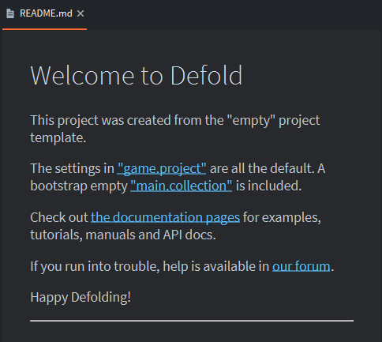

Par un clic droit sur un onglet et en sélectionnant `Move to other tab pane`, vous pouvez scinder la vue en deux pour travailler avec deux fichiers ouverts en même temps (par exemple, pour lire le tutoriel d'un fichier `README.md` tout en effectuant les consignes).
L'option `Swap with other tab pane` inverse le contenu des deux panneaux de la vue `Editor`.
L'option `Join tab panes` rassemble les deux panneaux en un seul.

**Remarque :** Le système de coordonnées de *Defold* est le même qu'en mathématiques. L'axe *Y* augmente vers le haut.

### Editeur de scène

Double cliquez sur un fichier `.collection` ou `.go`(*game object*) dans la vue `Assets` pour ouvrir l'éditeur de scène.

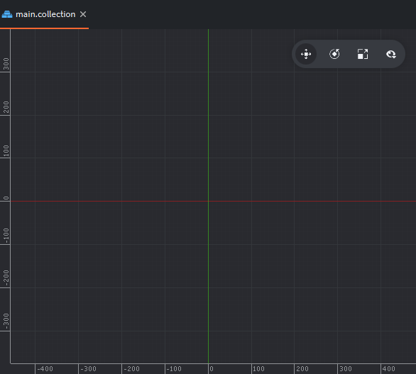

Pour sélectionner un élément, cliquez dessus dans l'éditeur de scène ou dans l'arborescence de la vue `Outline`.
Un objet sélectionné est encadré d'une ligne verte dans l'éditeur de scène et son élément est surligné dans la vue `Outline`.
Sélectionnez plusieurs éléments par cliqué glissé dans l'éditeur ou utilisez la touche `SHIFT` ou `CTRL` dans l'éditeur ou la vue `Outline`.
Pour déplacer un élément sélectionné, activez le mode `Move` (touche `W`). Cliquez glissez sur une des flèches du gizmo pour déplacer l'élément sur un seul axe. Faites de même sur les carrés pour déplacer l'élément librement.
Pour faire tourner un élément sélectionné, activez le mode `Rotate` (touche `E`). Cliquez glissez sur une des lignes colorées du gizmo pour faire tourner l'élément sur un seul axe ou sur le cercle pour faire tourner l'élément librement.
Pour redimensionner un élément sélectionné, activez le mode `Scale` (touche `R`). Cliquez glissez sur un des carrés du gizmo pour redimensionner l'élément sur un seul axe ou proportionnellement.

### Editeur de code

Lorsque vous double-cliquez sur un fichier source en langage *Lua*, l'éditeur de code intégré à *Defold* ouvre le fichier.

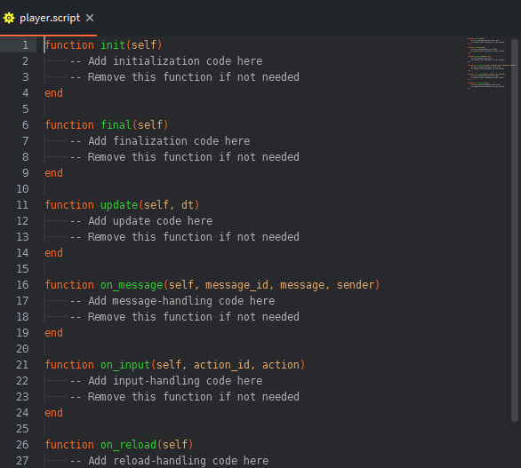

### Editeur de configuration du projet

Tous les paramètres du projet sont définis dans un fichier texte appelé `game.project`. Si vous l'ouvrez dans *Defold* par un double clic, la vue `Editor` permet de contrôler tous les paramètres dans un format plus ergonomique.

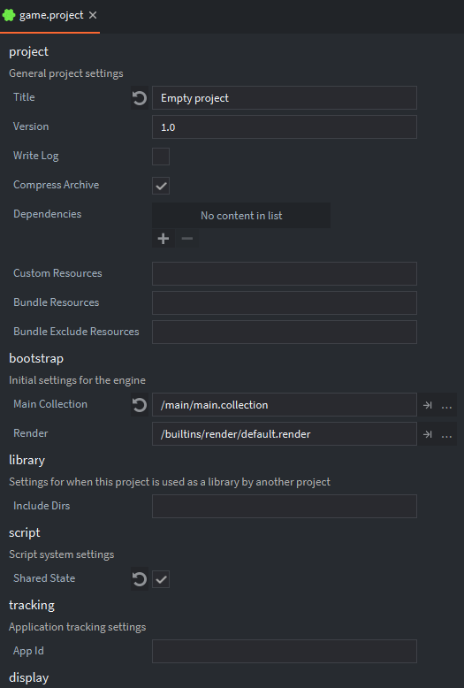

La liste de paramètres s'affiche dans l'éditeur. Les paramètres ayant des valeurs modifiées ont un bouton en forme de flèche circulaire pour rétablir leur valeur par défaut. Ils sont classés par sections :

**Attention !** Ce fichier doit rester à la racine du projet et ne doit pas être renommé.

**Remarque :** Vous pouvez éditer ce fichier avec un éditeur de texte. Seuls les attributs ayant déjà été modifiés (qui n'ont pas leur valeur par défaut) sont visibles. Vous pouvez également ouvrir ce fichier dans *Defold* en tant que fichier texte par un clic droit dans la vue `Assets` puis en choisissant `Open As` > `Text`.

#### Project

**Title :** Le titre de l'application. Apparaît dans la barre de la fenêtre du jeu.

**Version :** Version de l'application.

**Write Log :** Si vous cochez cette option, le moteur créera un fichier `log.txt` dans la racine du projet. Sur *iOS*, le fichier `log` peut être accédé avec *iTunes* et l'onglet `App` dans la section `Partage de Fichier`. Sur *Android*, le fichier est stocké dans l'emplacement externe d'application. Lorsque vous exécutez l'application de développement `dmengine`, vous pouvez voir le `log` avec la commande :
`$ adb shell cat /mnt/sdcard/Android/data/com.defold.dmengine/files/log.txt`

**Compress Archive :** Enables compression of archives when bundling. Note that this currently applies to all platforms except Android where the apk already contains all data compressed.

**Dependencies :** A list of URLs to the project Library URLs. For Defold hosted projects, the URL is found on the project page on the Dashboard). Note that you need read access to the URL. For Defold hosted projects, that means you need to be a member of the dependent projects.

**Custom Resources :** A comma separated list of resources that will be included in the project. If directories are specified, all files and directories in that directory are recursively included.

**bundle_resources (hidden setting) :** A directory containing resource files and folders that should be copied as-is into the resulting package when bundling. The directory is specified with an absolute path from the project root, for example /res. The resource directory must contain subfolders named by platform, or architecure-platform.
Supported platforms are *ios*, *android*, *osx*, *win32*, *linux*, *web*.
Supported arc-platform pairs are *armv7-ios*, *arm64-ios*, *armv7-android*, *x86-osx*, *x86_64-osx*, *x86-win32*, *x86_64-win32*, *x86-linux*, *x86_64-linux*, *js-web*.
A subfolder named `common` is also allowed, containing resource files common for all platforms.

**bundle_exclude_resources (hidden setting) :** A comma separated list of resources that should not be included in the bundle.

#### Bootstrap

**Main Collection :** Définit le fichier collection à ouvrir au lancement du jeu. Par défaut : `/logic/main.collection`.

**Render :** Choisit quel pipeline de rendu utiliser pour afficher le jeu. Par défaut : `/builtins/render/default.render`.

#### Library

**Include Dirs :** Une liste de dossiers séparés par un espace à partager depuis votre projet via le partage de bibliothèque.

#### Script

**Shared State :** Cochez si vous souhaitez partager un seul état *Lua* entre tous les types de scripts (standards, GUI et Render). Par défaut, non coché.

#### Tracking

**App Id :** Un identifiant unique de suivi pour ce projet. Cet identifiant peut être obtenu sur le dashboard du projet (sur le site de *Defold*).

#### Display

**Width :** La largeur en pixels de votre fenêtre de jeu. Par défaut : `960`.

**Height :** La hauteur en pixels de votre fenêtre de jeu. Par défaut : `640`.

**High Dpi :** Crée un tampon vidéo haute résolution sur les écran qui le supportent. Typiquement, le jeu sera rendu au double de la résolution spécifiée avec les réglages `Width` et `Height` qui seront utilisés dans les scripts et les propriétés.

**Samples :** Combien d'échantillons utiliser pour l’anti-crénelage de super échantillonnage (*SSAA*). Paramètre la valeur `GLFW_FSAA_SAMPLES`. Par défaut, vaut `0`, ce qui veut dire que l'anti-crénelage n'est pas activé.

**Fullscreen :** Cocher si le jeu doit démarrer en mode plein écran. Par défaut, décoché. Le jeu démarre en mode fenêtré.

**Update Frequency :** Fréquence de rafraîchissement. Par défaut : `60`. Les valeurs autorisées sont : `60`, `30`, `20`, `15`, `12`, `10`, `6`, `5`, `4`, `3`, `2` ou `1`.

**Variable Dt :** Check if time step should be measured against actual time spent in the update loop, uncheck if you want fixed time step (as set in `update_frequency`).

**Display Profiles :** Specifies which display profiles file to use, `/builtins/render/default.display_profilesc` by default.

**Dynamic Orientation :** Check if the app should dynamically switch between portrait and landscape on device rotation. Note that the development app does not currently respect this setting.

#### Physics

**Type :** Which type of physics to use, `2D` (default) or `3D`.

**Gravity Y :** World gravity along y-axis, -10 by default (natural gravity)

**Debug :** Check if physics should be visualized for debugging.

**Debug Alpha :** Alpha component value for visualized physics, 0–1. The value is `0.9` by default.

**World Count :** Max number of concurrent physics worlds, 4 by default. If you load more than 4 worlds simultaneously through collection proxies you need to increase this value. Be aware that each physics world allocates a fair amount of memory.

**Gravity X :** World gravity along x-axis, `0` by default.

**Gravity Z :** World gravity along z-axis, `0` by default.

**Scale :** Tells the physics engine how to scale the physics worlds in relation to the game world for numerical precision, 0.01–1.0. If the value is set to 0.02, it means that the physics engine will view 50 units as 1 meter (1 / 0.021/0.02). The default value is `1.0`.

**Debug Scale :** How big to draw unit objects in physics, like triads and normals, `30` by default.

**Max Collisions :** How many collisions that will be reported back to the scripts, `64` by default.

**Max Contacts :** How many contact points that will be reported back to the scripts, `128` by default.

**Contact Impulse Limit :** Ignore contact impulses with values less than this setting, `0.0` by default.

**Ray Cast Limit 2d :** The max number of 2d ray cast requests per frame. `64` by default.

**Ray Cast Limit 3d :** The max number of 3d ray cast requests per frame. `128` by default.

**Trigger Overlap Capacity :** The maximum number of overlapping physics triggers. `16` by default.

#### Graphics

**Default Texture Min Filter :** Specifies which filtering to use for minification filtering, `linear` (default) or `nearest`.

**Default Texture Mag Filter :** Specifies which filtering to use for magnification filtering, `linear` (default) or `nearest`.

**Max Draw Calls :** The max number of render calls, `1024` by default.

**Max Characters :** The number of characters pre-allocated in the text rendering buffer, i.e. the number of characters that can be displayed each frame, `8192` by default.

**Max Debug Vertices :** The maximum number of debug vertices. Used for physics shape rendering among other things, 10000 by default.

**Texture Profiles :** The texture profiles file to use for this project, `/builtins/graphics/default.texture_profiles` by default.

#### Input

**Repeat Delay :** Seconds to wait before a held down input should start repeating itself, `0.5` by default.

**Repeat Interval :** Seconds to wait between each repetition of a held down input, `0.2` by default.

**Gamepads :** File reference of the gamepads config file, which maps gamepad signals to OS, `/builtins/input/default.gamepads` by default.

**Game Binding :** File reference of the input config file, which maps hardware inputs to actions, `/input/game.input_binding` by default.

**Use Accelerometer :** Check to make the engine receive accelerator input events each frame. Disabling accelerometer input may give some performance benefit, checked by default.

#### Resource

**Http Cache :** If checked, a HTTP cache is enabled for faster loading of resources over the network to the running engine on device, unset by default.

**Uri :** Where to find the project build data, in URI format.

**Max Resources :** The max number of resources that can be loaded at the same time, `1024` by default.

#### Network

**Http Timeout :** The HTTP timeout in seconds. Set to `0` to disable timeout, which is the default.

#### Collection

**Max Instances :** Max number of game object instances in a collection, `1024` by default.

#### Sound

**Gain :** Global gain (volume), 0–1, The value is `1` by default.

**Max Sound Data :** Max number of sound resources, i.e the number of unique sound files at runtime, `128` by default.

**Max Sound Buffers :** (Currently not used) Max number of concurrent sound buffers, `32` by default.

**Max Sound Sources :** (Currently not used) Max number of concurrently playing sounds, `16` by default.

**Max Sound Instances :** Max number of concurrent sound instances, i.e. actual sounds played at the same time. `256` by default.

#### Sprite

**Max Count :** Max number of sprites, `128` by default.

**Subpixels :** Check to allow sprites to appear unaligned with respect to pixels, checked by default.

#### Spine

**Max Count :** Max number of spine models, `128` by default.

#### model
**Max Count :** `128` by default.

#### GUI

**Max Count :** Max number of GUI components, `64` by default.

**Max Particlefx Count :** The max number of concurrent emitters, `64` by default.

**Max Particle Count :** The max number of concurrent particles, `1024` by default.

#### Label

**Max Count :** Max number of labels, `64` by default.

**Subpixels :** Check to allow lables to appear unaligned with respect to pixels, checked by default.

#### Particle FX

**Max Count :** The max number of concurrent emitters, `64` by default.

**Max Particle Count :** The max number of concurrent particles, `1024` by default.

#### Collection proxy

Max Count :** Max number of collection proxies, `8` by default.

#### Collection factory

**Max Count :** Max number of collection factories, `128` by default.

#### Factory

**Max Count :** Max number of game object factories, `128` by default.

#### iOS

**App Icon 57x57–180x180 :** Image file to use as application icon at given width and height dimensions W × H.

**Launch Image 320x480–2436x1125 :** Image file to use as application launch image for resolution width and height dimensions W × H. iOS selects the display resolution based on the launch image.

**Pre Rendered Icons :** (iOS 6 and earlier) Check if your icons are pre-rendered. If this is unchecked the icons will get a glossy highlight added automatically.

**Bundle Identifier :** The bundle identifier lets iOS recognize any updates to your app. Your bundle ID must be registered with Apple and be unique to your app. You cannot use the same identifier for both iOS and OS X apps.

**Info.plist :** If specified, use this info.plist file when bundling your app.

#### Android

**App Icon 36x36–192x192 :** Image file to use as application icon at given width and height dimensions W × H.

**Push Icon Small–LargeXxxhdpi :** Image files to be used as custom push notification icon on Android. The icons will automatically be used for both local or remote push notifications. If not set the application icon will be used by default.

**Push Field Title :** Specifies which payload JSON field should be used as notification title. Leaving this setting empty makes the pushes default to the application name as title.

**Push Field Text :** Specifies which payload JSON field should be used as notification text. If left empty, the text in the field alert is used, just as on iOS.

**Version Code :** An integer value indicating the version of the app. Increase the value for each subsequent update.

**Package :** Package identifier.

**Gcm Sender Id :** Google Cloud Messaging Sender Id. Set this to the string assigned by Google to enable push notifications.

**Manifest :** If set, use the specified Android manifest XML file when bundling.

**Iap Provider :** Specifies which store to use. Valid options are Amazon and GooglePlay, `GooglePlay` by default.

**Input Method :** Specifies which method to use to get keyboard input on Android devices. Valid options are KeyEvent (old method) and HiddenInputField (new). `KeyEvent` by default.

**Immersive Mode :** If set, hides the navigation and status bars and lets your app capture all touch events on the screen.

#### MacOS / OS X

**App Icon :** Image file to use as application icon on MacOS.

**Info.plist :** If set, use the specified info.plist file when bundling.

**Bundle Identifier :** The bundle identifier lets OS X recognize updates to your app. Your bundle ID must be registered with Apple and be unique to your app. You cannot use the same identifier for both iOS and OS X apps.

#### Windows

**App Icon :** Image file to use as application icon on Windows.

**Iap Provider :** Specifies which store to use. Valid options are None and Gameroom, `None` by default.

#### HTML5

**Set Custom Heap Size :** If set, Emscripten allocates custom_heap_size number of bytes for the application heap.

**Custom Heap Size :** Sets the custom heap size (number of bytes) for Emscripten to use if `set_custom_heap_size` is set. If not set, `256MB` is allocated for the application heap.

**Include Dev Tool :** Includes a visual dev-tool in the application that allows tracking of memory usage.

**.html Shell :** If set, use the specified template *HTML* file when bundling.

**Custom .css :** If set, use the specified *CSS* file when bundling.

**Splash Image :** If set, use the specified splash image on startup when bundling.

**Archive Location Prefix :** When bundling for *HTML5* game data is split up into one or more archive data files. When the engine starts the game, these archive files are read into memory. Use this setting to specify the location of the data, `archive` by default.

**Archive Location Suffix :** Suffix to be appended to the archive files. Useful to, for instance, force non-cached content from a CDN (?version2 for example).

#### Facebook

**Appid :** The application id as issued by Facebook.

#### IAP

**Auto Finish Transactions :** Check to automatically finish IAP transactions. If unchecked, you need to explicitly call `iap.finish()` after a successful transaction, checked by default.

#### native_extension

**App Manifest :** If set, use the app manifest to customize the engine build. This allows you to remove unneeded parts from the engine making it possible to decrease the final binary size. Note that this feature is in alpha state. Please visit the forum for information on how to proceed. Default empty.

#### profiler

**TrackCpu :** If checked, enable CPU profiling in release versions of the builds. Normally, you can only access profiling information in debug builds. Default disabled.

**File format :** The format of the settings file is simple text and can be edited by any standard text editor. The format looks like this:

```
[category1]
setting1 = value
setting2 = value
[category2]
...
```

A real example is:

```
[bootstrap]
main_collection = /main/main.collectionc
```

which means that the setting main_collection belongs to the bootstrap category. Whenever a file reference is used, like the example above, the path needs to be appended with a ‘c’ character, which means you’re referencing the compiled version of the file. Also note that the folder containing game.project will be the project root, which is why there is an initial ‘/’ in the setting path.

Setting config values on engine startup
When the engine starts, it is possible to provide config values from the command line that override the game.project settings:

```lua
# Specify a bootstap collection
$ dmengine --config=bootstrap.main_collection=/my.collectionc

# Set the custom value "test.my_value"
$ dmengine --config=test.my_value=4711
```

Custom values can—just like any other config value—be read with `sys.get_config()`.

#### Live update

**Private Key :** If set, use the specified private key file when bundling live update content. If no key file is set, a key is generated.

**Public Key :** If set, use the specified public key file when bundling live update content. If no key file is set, a key is generated.

## Préparatifs à effectuer

*Defold* suppose que les ressources externes (images et sons) sont prêtes à être utilisées. Vous devez donc commencer par les importer dans vos projets ou à défaut, utiliser des ressources temporaires de remplacement.

### Importer des images

Pour importer des images dans votre projet, faites simplement glisser depuis votre système les fichiers images (au format `.png` ou `.jpg`) dans la vue `Assets` à l'emplacement désiré. Les fichiers sont dupliqués dans le projet. Les images d'origines sont donc toujours accessibles à l'emplacement d'origine.

**Remarque :** N'oubliez pas que vous pouvez supprimer les images inutiles dans la vue `Assets` par un clic droit suivi de l'option `Delete`.

*Defold* propose deux façons de gérer les images selon qu'elles sont rassemblées ou non dans un même fichier.

#### Gérer des images individuelles

Les images individuelles ne peuvent pas être directement utilisées dans *Defold*. Elles doivent d'abord être intégrées à un fichier ressource `Atlas`. Ce dernier rassemble plusieurs images individuelles dans une seule texture (une image chargée en mémoire vidéo) pour optimiser le jeu (principalement pour économiser la mémoire et améliorer la performance d'accès à ces images). Un atlas peut en outre posséder des groupes d'animations qui contiendront à leur tour une série d'images qui définiront une animation. Pour créer un nouveau fichier ressource atlas, faites un clic droit dans la vue `Assets` à l'emplacement désiré puis choisissez l'option `New...` > `Atlas`. La boîte de dialogue `New Atlas` apparaît :

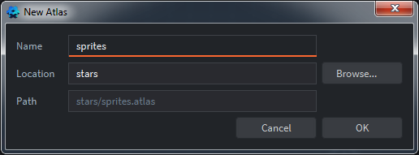

- Le champ `Name` vous permet de définir le nom de l'atlas.
- Le champ `Location` et le bouton `Browse...` vous permettent de définir l'emplacement de l'atlas.
- Le champ `Path` vous indique le chemin complet de l'atlas.

Cliquez sur le bouton `OK` pour créer l'atlas ou le bouton `Cancel` pour annuler. Un nouvel atlas vide apparaît dans la vue `Editor` :

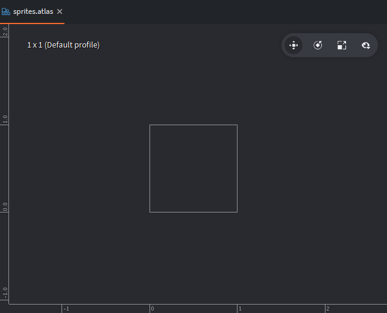

Pour ajouter des images à l'atlas, dans la vue `Outline` faites un clic droit sur l'atlas et choisissez l'option `Add Images...` :

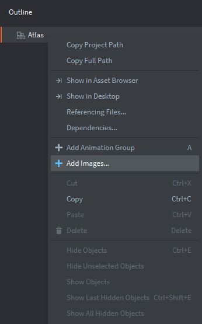

La boîte de dialogue `Select Images` apparaît :

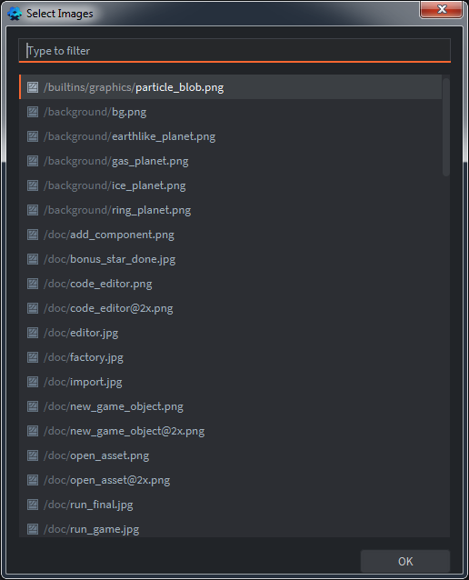

Sélectionnez les images à ajouter à l'atlas puis cliquez sur le bouton `OK`. La vue `Editor` affiche les images dans l'atlas et la vue `Outline` affiche la liste de fichiers ressources images (en *italique* suivi de leur chemin complet) :

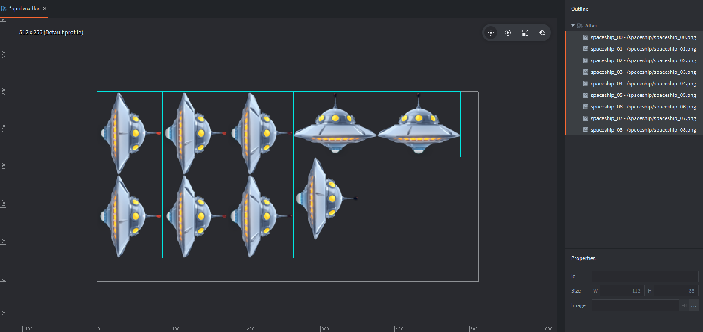

##### Importer une série d'images en tant qu'animation

Un atlas peut également contenir des groupes d'animation. Ceux-ci sont composées d'une série d'images définissant une animation. Pour ajouter un nouveau groupe d'animation à un atlas, faites un clic droit sur l'atlas dans la vue `Outline` et choisissez l'option `Add Animation Group` (touche `A`) :

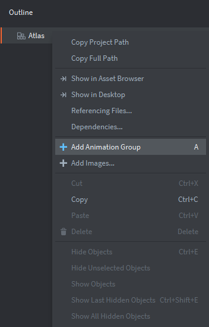

Dans la vue `Outline`, un nouveau groupe d'animation apparaît :

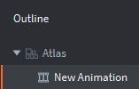

**Remarque :** Vous pouvez renommer le groupe d'animation dans la vue `Properties`.

Ajoutez ensuite les images à ce groupe par un clic droit suivi de l'option `Add Images...` :

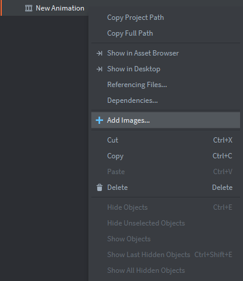

La boîte de dialogue `Select Images` apparaît :


Sélectionnez les images à ajouter au groupe d'animation de l'atlas puis cliquez sur le bouton `OK`. La vue `Editor` affiche les images dans l'atlas et la vue `Outline` affiche la liste des ressources images (en *italique* suivi de leur chemin complet) sous le groupe d'animation :

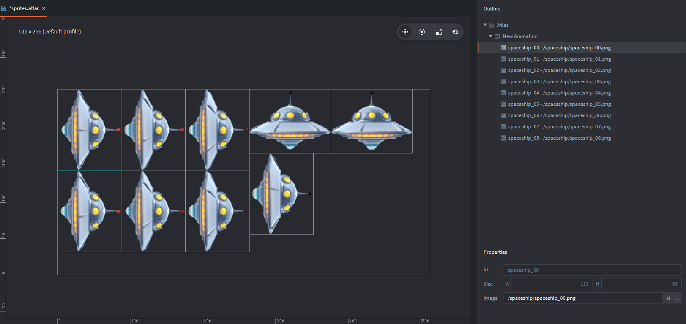

**Remarque :** Si vos images ne sont pas dans l'ordre, vous devez les importer une à une.

Vous pouvez éditer les propriétés du groupe d'animation dans la vue `Properties` :

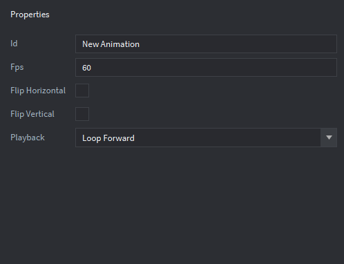

- Le champ `Id` vous permet de définir le nom du groupe d'animation.
- Le champ `Fps` vous permet de définir la vitesse d'animation (en images par secondes).
- L'option' `Flip Horizontal` vous permet de définir si l'animation doit être retournée horizontalement ou non (décoché par défaut).
- L'option' `Flip Vertical` vous permet de définir si l'animation doit être retournée verticalement ou non (décoché par défaut).
- Le menu déroulant `Playback` vous permet de définir la façon dont est lue l'animation :
  - L'option `None` bloque l'animation sur la première image.
  - L'option `Once Forward` lit l'animation en avant une seule fois.
  - L'option `One Backward` lit l'animation à l'envers une seule fois.
  - L'option `Once Ping Pong` lit l'animation en avant puis à l'envers une seule fois.
  - L'option `Loop Forward` (par défaut) lit l'animation en avant indéfiniment.
  - L'option `Loop Backward` lit l'animation en arrière indéfiniment.
  - L'option `Loop Ping Pong` lit l'animation en avant puis en arrière indéfiniment.

#### Gestion des tilesheet ou spritesheet

Si un fichier image contient plusieurs images (uniquement disposées dans des tuiles de tailles identiques), vous devez créer un fichier ressource `Tile Source` dans la vue `Assets` par un clic droit à l'emplacement désiré puis choisir l'option `New...` > `Tile Source`. La boîte de dialogue `New Tile Source` apparaît :

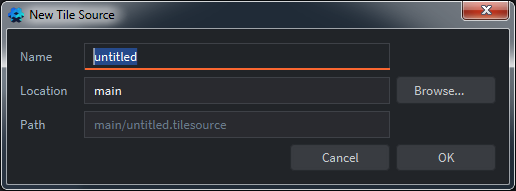

- Le champ `Name` vous permet de définir le nom de la tile source.
- Le champ `Location` et le bouton `Browse` vous permettent de définir l'emplacement de la tile source.
- Le champ `Path` affiche le chemin complet de la tile source.

Cliquez sur le bouton `OK` pour créer la tile source ou sur le bouton `Cancel` pour annuler. Une nouvelle tile source vide apparaît dans la vue `Editor` :

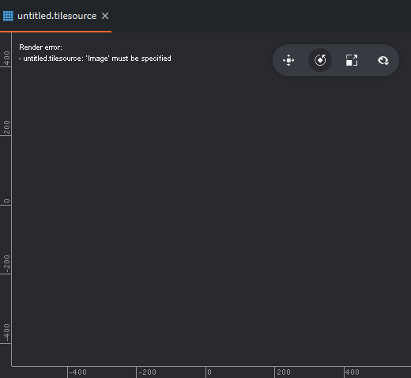

La vue `Editor` indique que la tile source nécessite de définir la propriété `Image` (`'Image' must be specified`). Dans la vue `Properties`, cliquez sur l'icônes `...` à droite du champ `Image` :

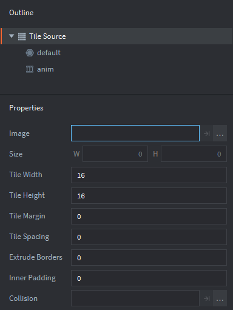

Cela ouvre la boîte de dialogue `Select Resource` :

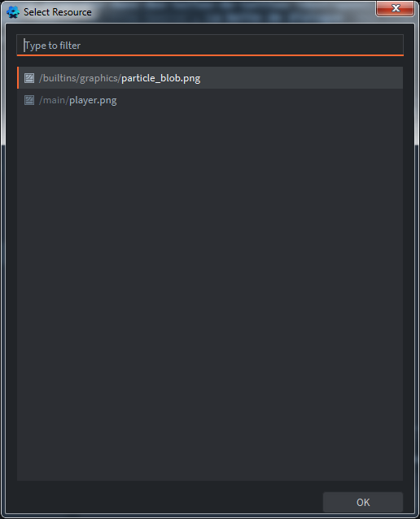

Choisissez l'image à utiliser puis cliquez sur le bouton `OK`. La vue `Editor` affiche l'image importée (pour centrer la vue sur l'image appuyez sur la touche `F`). En haut à gauche, un texte indique le numéro de tuile de l'image survolée par la souris :

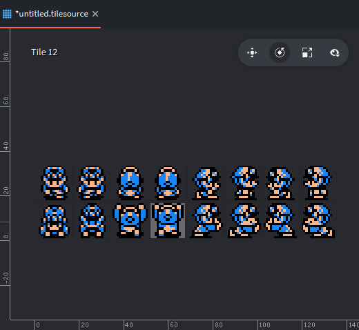

La vue Properties vous permet de définir les propriétés de la tile source :

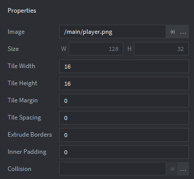

- Le champ `Image` vous permet de définir le fichier ressource image à utiliser dans la tile source.
- Les champs `W` et `H` de la section `Size` affichent la largeur (`W`) et la hauteur (`H`) en pixels de l'image utilisé dans la tile source.
- Le champ `Tile Width` vous permet de définir la largeur en pixels des tuiles de la tile source.
- Le champ `Tile Height` vous permet de définir la hauteur en pixels des tuiles de la tile source.
- Le champ `Tile Margin` vous permet de définir la marge en pixels autour des tuiles de la tile source.
- Le champ `Tile Spacing` vous permet de définir l'espacement en pixels existant entre les tuiles de la tile source dans le fichier d'origine.
- Le champ `Extrude Borders` vous permet de définir la taille en pixels du débordement des tuiles de la tile source.
- Le champ `Inner Padding` vous permet de définir l'espacement en pixels à ajouter autour des tuiles dans la tile source.
- Le champ `Collision` vous permet de définir un fichier ressource image à utiliser en tant que collision.

##### Définir des animations de tile source

Une tile source permet de définir des animations composées de tuiles successives dans l'image source. Pour créer une nouvelle animation, dans la vue `Outline` faites un clic droit sur la tile source et choisissez l'option `Add` > `Animation` :

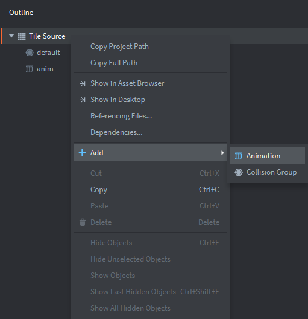

Une nouvelle animation apparaît dans la vue `Outline` :

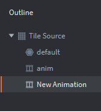

Vous pouvez alors éditer ses propriétés dans la vue `Properties` :

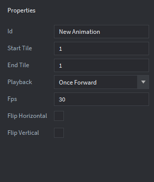

- Le champ `Id` vous permet de définir le nom de l'animation.
- Le champ `Start Tile` vous permet de définir l'index de la première tuile de l'animation.
- Le champ `End Tile` vous permet de définir l'index de la dernière tuile de l'animation.
- Le champ `Playback` vous permet de définir la façon de lire l'animation.
  - L'option `None` bloque la lecture de l'animation sur la première tuile.
  - L'option `Once Forward` lit l'animation en avant une seule fois.
  - L'option `Once Backward` lit l'animation en arrière une seule fois.
  - L'option `Once Ping Pong` lit l'animation en avant puis en arrière une seule fois.
  - L'option `Loop Forward` lit l'animation en avant indéfiniment.
  - L'option `Loop Backward` lit l'animation en arrière indéfiniment.
  - L'option `Loop Ping Pong` lit l'animation en avant puis en arrière indéfiniment.
- Le champ `Fps` vous permet de définir la vitesse de lecture de l'animation (en images par secondes).
- Le champ `Flip Horizontal` vous permet de retourner horizontalement l'animation (décoché par défaut).
- Le champ `Flip Vertical` vous permet de retourner verticalement l'animation (décoché par défaut).

## Structure du jeu

Dans *Defold*, chaque écran de jeu est représenté par une `Collection`. Dans le fichier de configuration `game.project`, un fichier `.collection` doit être défini comme collection de démarrage du jeu (section `Bootstrap` > `Main collection`).

**Remarque :** Par défaut, *Defold* crée un fichier `main.collection` défini comme collection de lancement dans le fichier de configuration de tout nouveau projet.

Une collection est constituée de sous-éléments (de sous-collections et de game objects) qui définissent les éléments essentiels du jeu. Ces derniers sont à leur tour constitués de sous-éléments constituant ainsi une arborescence. Une collection ouverte dans l'éditeur affiche la hiérarchie de ses éléments dans la vue `Outline`. Une sous-collection peut servir à définir un ensemble de game objects constituant un élément du jeu. Elle peut ensuite être attachée à une collection mère qui représentera un écran de jeu complet.

Un game object est un conteneur à components. Ils ne possèdent que des propriétés de transformations (position, rotation, échelle). Vous pouvez intégrer des game objects directement dans une collection où les sauvegarder en tant que fichier de ressource ayant l'extension `.go`.

Les components sont les éléments essentiels au jeu. Ce sont eux qui définissent les graphismes, les sons ou les comportements des game objects qui les contiennent.

Enfin, certains components peuvent avoir comme enfants des éléments particuliers (par exemple les components `Collision Object` ont en général un élément enfant de type `Shape`).

Tous les fichiers qui ne sont pas des collections sont considérés comme des ressources et peuvent être référencés dans les collections. Il apparaissent alors avec le chemin du fichier écrit en italique à côté de leur nom (`Id`) dans la vue `Outline`.

## Créer une collection

Dans la vue `Assets`, faites un clic droit à l'endroit où vous souhaitez créer un game object et choisissez l'option `New...` > `Collection`.

La boîte de dialogue `New Collection` apparaît :

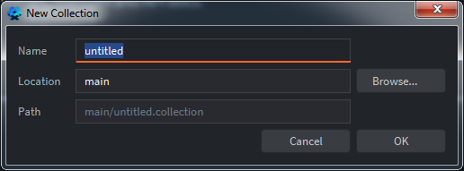

- Le champ `Name` vous permet de définir le nom de la collection.
- Le champ `Location` et le bouton `Browse…` vous permettent de définir l'emplacement de la collection dans votre projet.
- Le champ `Path` indique le chemin complet de la collection.

Cliquez sur le bouton `OK` pour créer la collection ou le bouton `Cancel` pour annuler. La vue `Editor` affiche un onglet contenant la nouvelle collection :

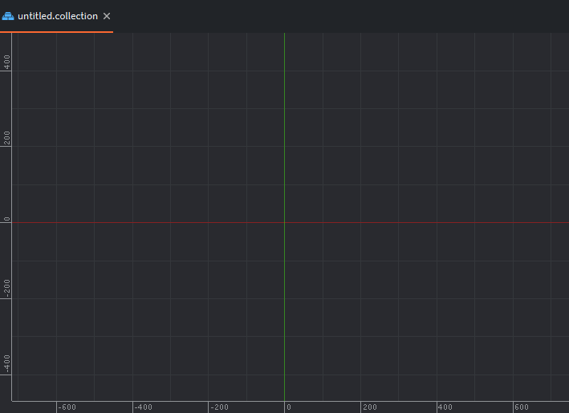

La vue `Outline` montre que celle-ci ne possède pour le moment aucun sous élément :

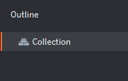

Vous pouvez désormais attacher des sous-collections ou des game objects (en place ou externes) à cette collection par un clic droit dans la vue `Outline`.

## Créer un game object

Vous pouvez créer des fichiers ressources `Game Object` depuis la vue `Assets` ou créer directement un game object en place dans une collection depuis la vue `Outline`.

### Créer un fichier ressource Game Object

Pour  créer un fichier ressource `Game Object`, dans la vue `Assets` faites un clic droit à l'endroit où vous souhaitez créer le game object et choisissez l'option `New...` > `Game Object`.

La boîte de dialogue `New Game Object` apparaît :

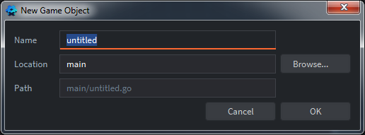

- Le champ `Name` vous permet de définir le nom du game object.
- Le champ `Location` et le bouton `Browse…` vous permettent de définir l'emplacement du game object dans votre projet.
- Le champ `Path` indique le chemin complet du game object.

Cliquez sur le bouton `OK` pour créer le game object ou le bouton `Cancel` pour annuler. La vue `Editor` affiche un onglet contenant le nouveau game object.

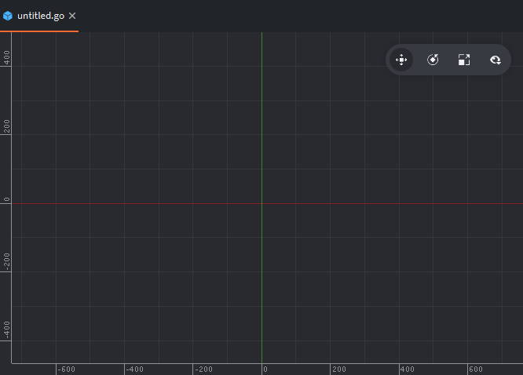

La vue `Outline` montre que celui-ci ne possède pour le moment aucun component.

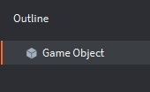

Vous pouvez désormais attacher des sous-collections ou des game objects (en place ou externes) à cette collection par un clic droit dans la vue `Outline`.

### Attacher un game object en place à une collection

Pour attacher un game object en place à une collection, dans la vue `Outline`, faites un clic droit sur la collection et choisissez l'option `Add Game Object` (touche `A`) :

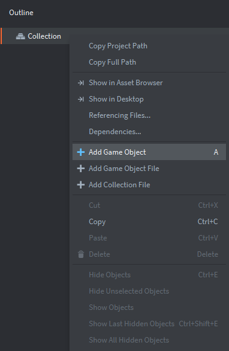

Le nouveau game object apparaît dans l'arborescence de la vue `Outline` et ses propriétés s'affichent dans la vue `Properties` :

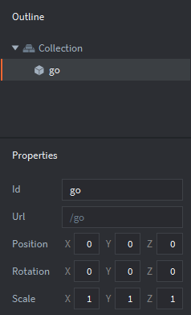

Vous pouvez désormais attacher des components ou des sous-game objects (en place ou externes) à ce game object par un clic droit dans la vue `Outline`.

## Ajout de components à un game object

Dans la vue `Editor`, l'onglet actif doit être un game object ou une collection pour que la vue `Outline` en affiche la structure. Pour attacher un component à un game object, dans la vue `Outline`, faites un clic droit sur le game object, choisissez l'option `Add Component` puis choisissez un component à attacher en place (c'est-à-dire directement intégré au fichier ressource contenant le game object) au game object sélectionné.

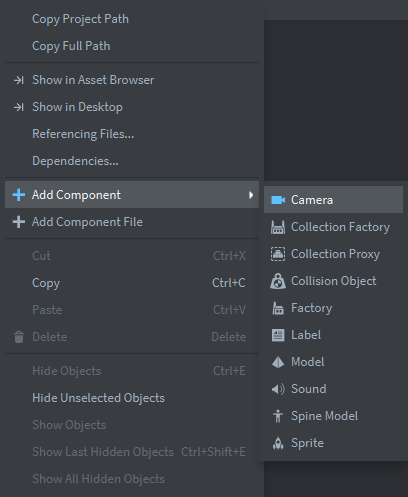

Le component attaché en place apparaît dans la vue `Outline`.

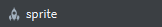

**Remarque :** Seules les components de type `Camera`, `Collection Factory`, `Collection Proxy`, `Collision Object`, `Factory`, `Label`, `Model`, `Sound`, `Spine Model` et `Sprite` peuvent être attachés en place à un game object. Les autres components doivent être attachés via l'option `Add Component File` depuis un fichier ressource :

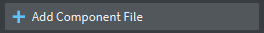

La boîte de dialogue `Select Component File` apparaît. Choisissez alors le fichier correspondant à la ressource à attacher au game object selectionné.

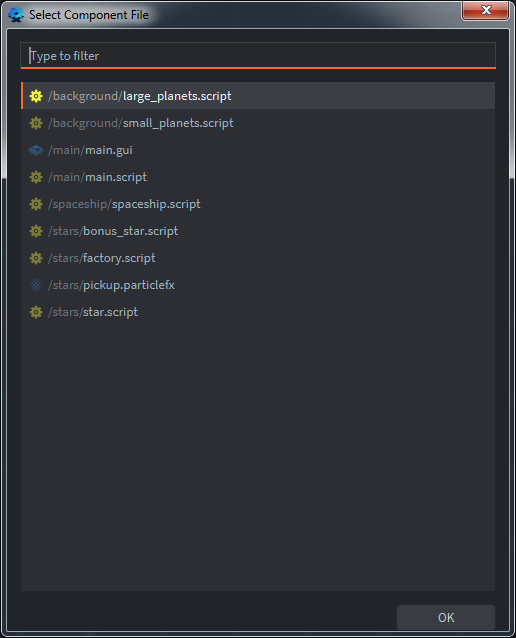

Contrairement à un component attaché en place, un component défini dans un fichier ressource apparaît en *italique* suivi du chemin du fichier dans la vue `Outline`.

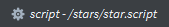

**Conseil :** Utilisez les components définis dans des fichiers ressources lorsque vous souhaitez les réutiliser dans plusieurs game objects.

### Les collections

Une collection est toujours un fichier. 

#### Créer une collection

Pour créer un nouveau fichier collection, dans la vue `Assets`, faites un clic droit à l'emplacement de votre choix, choisissez `New` > `Collection` et donnez-lui un nom. *Defold* utilse l'extension `.collection` pour les fichiers collection.

#### Attacher un game object à une collection

Si la collection n'est pas ouverte dans l'éditeur, ouvrez-la.
Si vous voulez créer un game object en place, faites un clic droit sur la collection dans la vue `Outline` et choisissez `Add Component` > `game object`.
Si vous voulez attacher un fichier ressource game object (préexistant sous la forme d'un fichier) dans la vue `Assets`, faites un clic droit sur la collection dans la vue `Outline` et choisissez `Add Game Object File` puis choisissez le game object désiré.

### Les game objects

#### Créer un game object

Vous pouvez créer un fichier game object réutilisable en faisant un clic droit dans la vue `Assets` et choisissez `New` > `game object` et donnez-lui un nom. *Defold* utilse l'extension `.go` pour les fichiers game object.
Vous pouvez également créer un `game object` intégré en l'attachant à une collection ou à un autre `game object` directement dans la vue `Outline`.

#### Attacher un component à un game object

Si le game object n'est pas ouvert dans l'éditeur, ouvrez-le.
Si vous voulez créer un Component unique, faites un clic droit sur le game object dans la vue `Outline` et choisissez `Add Component` puis sélectionnez le Component de votre choix.
Si vous voulez attacher un Component préexistant stocké sous forme de fichier (par exemple, pour le réutiliser dans plusieurs game objects) dans la vue `Assets`, faites un clic droit sur le game object ouvert dans la vue `Outline` et choisissez `Add Component File` puis choisissez le fichier Component désiré.

#### Le component Camera
Dans *Defold*, une caméra est un component qui gère la vue dans le jeu. Il n'y a pas besoin de caméra par défaut, mais si votre jeu nécessite de se déplacer dans un niveau, *Defold* fournit un component de base appelé `Camera`. Les caméras ont une position dans l'espace. Elles peuvent être déplacées en positionnant le game object les contenants. Elle incluent un script de rendu avec les données nécessaires pour rendre la vue correctement.
Les caméras en *OpenGL* sont exprimées en tant que système de coordonnées avec un observateur (ou oeil), une position, et un plan limite de vue de près et de loin. Le plan de près est le plan visible (ou l'écran).

Camera planes 

Une caméra 3D a généralement un volume de vue (un frustum) qui a la forme d'une pyramide coupée. Cela a pour effet que les objets les plus éloignés de la caméra apparaissent plus petits. La perspective est réaliste. Plus le champ de vision est large, plus la caméra voit de parties de la scène et plus la différence entre des objets éloignés est importante.

Camera field of view 

### Créer une caméra

Pour créer une caméra, ajoutez un Component `Camera` à un `game object`.Vous pouvez créer un fichier Camera réutilisable en faisant un clic droit dans la vue `Assets` et choisissez `New -> Camera` et donnez-lui un nom. Defold utilse l'extension `.camera` pour les fichiers game object.

The camera component has a set of properties that defines the camera frustum.

Camera properties 

The current default FOV value is misleading. It is not expressed in degrees but in radians. For a 45 degree FOV, change the value to 0.785 (𝛑 / 4).
**aspect_ratio :** The ratio between the frustum width and height. 1.0 means that you assume a quadratic view. 1.33 is good for a 4:3 view like 1024x768. 1.78 is good for a 16:9 view.
**fov :** The camera field of view expressed in radians.
**near_z :** The Z-value of the near clipping plane.
**far_z :** The Z-value of the far clipping plane.
**auto_aspect_ratio :** Set this to 1 to let the camera automatically set the aspect ratio based on the game’s screen settings.
**Camera focus :** To activate the camera and have it feed its view and projection matrices, you send the component an `acquire_camera_focus` message:

`msg.post("#camera", "acquire_camera_focus")`

As soon as the camera component has camera focus, each frame it will send a `set_view_projection` message to the `@render` socket, i.e. to your render script:

```lua
-- example.render_script

function update(self)
   ...
   render.set_view(self.view)

   render.set_projection(self.projection)
   ...
end

function on_message(self, message_id, message)
   if message_id == hash("set_view_projection") then
           -- Camera view and projection arrives here. Store them.
       self.view = message.view
       self.projection = message.projection
   end
end
```

If you use both camera view and projection in your render script you will get a camera view into your game world with 3D perspective, even if your game content is strictly 2D. This is sometimes useful. You can, for instance, move the camera back to reveal more of the level. A simple camera script that measures the current camera move speed and pulls it back relative that speed could look like this:

```lua
-- camera.script

function init(self)
        msg.post("#camera", "acquire_camera_focus")

   -- Track current position and where someone told us to look at.
        self.pos = go.get_world_position()
        self.look_at = self.pos
end

function update(self, dt)
        -- Calculate a new position based on current pos interpolated towards current
        -- target position.
        self.pos = vmath.lerp(0.03, self.pos, self.look_at)
        
        -- Measure speed on the 2D plane (zero Z)
        local v1 = go.get_world_position()
        v1.z = 0
        local v2 = self.pos
        v2.z = 0
        local speed = vmath.length(v2 - v1)

        -- Depending on how fast player is moving, pull camera back or push it forward.
        self.pos.z = 500 + speed * speed * 10
        go.set_position(self.pos)
end

function on_message(self, message_id, message, sender)
   -- This camera reacts to "look_at" messages with a position as where
   -- to go.
        if message_id == hash("look_at") then        
                self.look_at = message.position
        end
end
```

Camera speed distance 

Of course, we’re not limited to moving the camera around. We can also rotate it along its X, Y and Z axis.
-- 0.314 radians is about 18 degrees.
go.set_rotation(vmath.quat_rotation_z(0.314) * vmath.quat_rotation_y(0.314))

Rotated camera 

Orthographic projection

For many 2D games, the business of having a camera that can move back and forth becomes a problem, especially if you have content that you would like to render pixel perfect. Instead of trying to place your camera at the perfect Z distance to get the view you want, you should instead set up a camera with orthographic projection. This means that the view of the camera is no longer dictated by a frustum, but by a much simpler box.
 Orthographic projection 

Orthographic projection is unrealistic in that it does not alter the size of objects based on their distance. A person standing 10000 meters away will still render at the same size as the person standing right in front of the camera. However, this method of projecting graphics is sometimes useful and 2D games often benefit from using it. To use orthographic projection you just have to modify your render script:

```lua
-- example.render_script

function update(self)
   ...
   render.set_view(self.view)
   -- Set up an orthographic projection based on the width and height of the
   -- game window.
        local w = render.get_width()
        local h = render.get_height()
        render.set_projection(vmath.matrix4_orthographic(- w / 2, w / 2, -h / 2, h / 2, -1000, 1000))
   ...
end

function on_message(self, message_id, message)
   if message_id == hash("set_view_projection") then
           -- Camera view and projection arrives here. We only need the view.
       self.view = message.view
   end
end
```

This is almost what the default render script does, with the difference that the above example centers the screen at the camera position.

### Le component Collection Factory

### Le component Collection Proxy

### Le component Collision Object
Vous devez attacher une Shape (forme) à l'objet. Faites un clic droit dans la vue `Outline` sur le Collision Object, choisissez `Add Shape` puis choisissez la forme `Box`, `Capsule` ou `Sphere`.

### Le component Factory

### Le component Label

### Le component Model

### Le component Sound

### Le component Spine Model

### Le component Sprite

## Script

Les variables locales à un script sont communes à toutes les instances. Les propriétés associées à la table `self` sont uniques à chaque instance. Pour afficher une propriété dans la vue `Properties`. 
Avec la commande `File` > `Hot Reload`, vous pouvez tester les modifications apportées à un script alors que votre jeu s'exécute déjà.

### Créer un game object depuis un script

### Détruire un game object depuis un script

Dans la fonction `update`, utilisez la fonction `go.delete` (en général selon une condition particulière) :

```lua
function update(self, dt)
    if go.get_position().x < 0 then
        go.delete()
    end
end
```

## Adressage

Pour cibler le script courant, utiliser la chaîne "#" :

`"#"`

Pour cibler le game object courant, utiliser la chaîne "." :

`"."`

Pour cibler un component situé dans le même game object que le script, utilisez l'identifiant du component précédé du signe `#` :

`#component_id`

Pour cibler un component situé dans un autre game object que le script mais dans la même collection, utilisez l'identifiant du game object, suivi du signe `#` puis de l'identifiant du Component :

`go_id#component_id`

Pour cibler un component situé dans un autre game object que le script et dans une autre collection statique, vous devez utiliser l'adressage absolu. Utilisez le caractère `/` pour indiquer que vous commencez l'adressage à la racine suivi de l'identifiant de la collection à cibler suivi du caractère `/` puis de l'identifiant du game object, suivi du signe `#` et enfin de l'identifiant du component :

`/main/go_id#component_id`

**Remarque :** Vous pouvez également cibler une sous collection :

`/main/sub/go_id#component_id`

Pour cibler un component situé dans un autre game object que le script et dans une collection générée par un component Collection proxy, vous devez utiliser l'adressage absolu en précisant le socket du monde de jeu à cibler. Utilisez l'identifiant de la collection à cibler suivi des caractères `:/` puis de l'identifiant du game object, suivi du signe `#` et enfin de l'identifiant du component :

`main:/go_id#component_id`

**Remarque :** Vous pouvez également cibler une sous collection :

`main:/sub/go_id#component_id`

Pour envoyer un message à un script d'un autre game object, utilisez la fonction `msg.post` avec l'identifiant du game object, suivi du signe `#` puis de l'identifiant du script :

`msg.post(other_game_objet#other_script, "message")`

## Astuces diverses

### Définir la collection principale

Ouvrez le fichier `game.project`. Dans la section `Bootstrap`, affectez le fichier collection de votre choix au champ `Main Collection`.

### Définir les dimensions logiques du jeu

Ouvrez le fichier `game.project`.  Dans la section `Display`, saisissez la largeur dans le champ `Width` et la hauteur dans le champ `Height` (en pixels).

### Afficher une image

Attachez à la collection définie comme collection principale un game object et attachez à celui-ci un component `Sprite`. Enfin, attribuez au sprite un atlas et une animation.

### Quitter le jeu avec la touche Echap

Dans le menu `File` > `Preferences`, dans l'onglet `General`, cochez la case `Escape Quits Game`. Cette option ne fonctionne qu'en phase de test.
